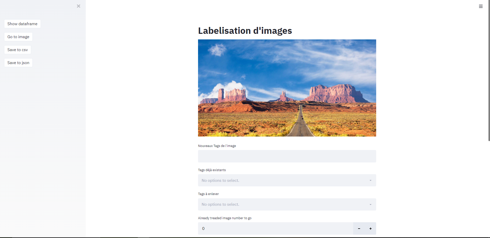
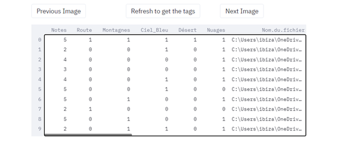
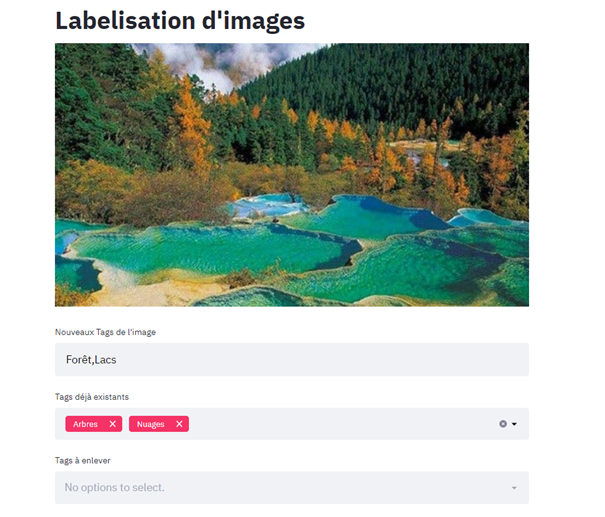
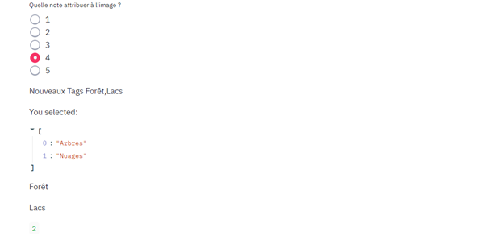

#Application de labelisation d'images

Objectifs proposer une application permettant de labeliser facilement des images et d'enregistrer le résultat sous format csv ou json :
================== 

1. Fonctionnement général

 
 
Le programme prend en paramètres un dossier contenant des images au format png ou jpeg et (optionnel) un fichier csv/txt ce qui permet de continuer une labelisation déjà commencée. La labelisation se fait de façon binaire, si un "tag" est présent pour une image, on meet une valeur de 1, 0 sinon.

Les images sont affichées à l'écran 1 par 1, on peut utiliser les boutons "Previous Image" et "Next Image" pour reculer et avancer dans la liste d'images. Dans le menu déroulant en haut à gauche, des boutons permettent d'afficher le dataframe contenant les données de la session de labelisation en cours. 

 
 
  
 
Le bouton "Go to image" permet de passer à l'image dont l'index est celui renseigné dans la zone "Already Treated image nulmber to go".  Le bouton "Go to image" permet de passer à l'image dont l'index est celui renseigné dans la zone "Already Treated image nulmber to go". et de se rendre à une image particulière et de sauvegarder en csv et/ou json. En csv, on obtient un dataframe contenant en lignes les images et en colonnes le nom des images (chemin d'accès), la note des images et l'ensemble des tags. Pour chaque image et chaque tag, on a 0 si l'image ne contient pas le tag, 1 si elle le contient. En json, on ne stocke que les tags possédés pour une image.

 
2.Ajouter des tags et noter les images

Pour chaque image, il est possible de lui attribuer des "tags" représentant son contenu. Pour ajouter des tags qui n'ont pas encore été utilisés, on utilise la première zone de sélection "Nouveaux Tags de l'image". Les tags doivent être écrits à la suite, sans espace mais séparés par des virgules.

Une fois un tag utilisé pour la première fois, il est ajouté aux "Tags déjà existants"; Il est alors possible de selectionner les tags déjà utilisés dans la deuxième zone. En cas d'erreur, il est possible d'enlever des tags avec la zone "Tags à enlever"

 

Il est également possible d'attribuer une note aux images, note allant de 1 à 5. Pour cela , on utilise la zone de selection de notes

 
 
 3.Limites

Renseigner un tag, ou une note n'entraine généralement pas un rafraichissement instantané des variables. Il est donc recommandé de procéder de la façon suivante :

**1 = Ajouter tous les nouveaux tags de l'image
2 = Renseigner les tags déjà existants
3 = Noter l'image
4 = Aller à l'image précédente, suivante ou sauter avec le bouton "Go to" apèrès avoir renseigné un index d'image vers lequel aller.**

Ajouter de nouveaux tags après avoir renseigné la zone "tags existants" réinitialise cette dernière car elle doit prendre en compte l'ajout des nouveaux tags pour les rendre selectionnables.

Il est possible de modifier à posteriori les tags des images mais pas les notes.

4.Utilisation

Se placer au niveau du dossier et utiliser la commande suivante (nécessite Streamlit, Pandas, et PIL) :

streamlit run Annotation.py -- "Chemin du dossier d'images" "Chemin du csv contenant un précédent travail si existant"

Un dossier contenant des images d'exemples ainsi que le résultat sous format csv et json sont présents

5.Remerciements

TVST pour son programme SessionState qui permet de converser des variables sur streamlit entre différentes pages 
https://gist.github.com/tvst/036da038ab3e999a64497f42de966a92/
